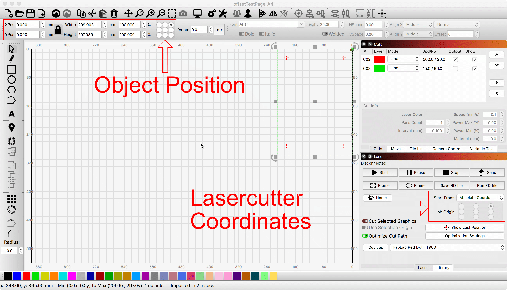
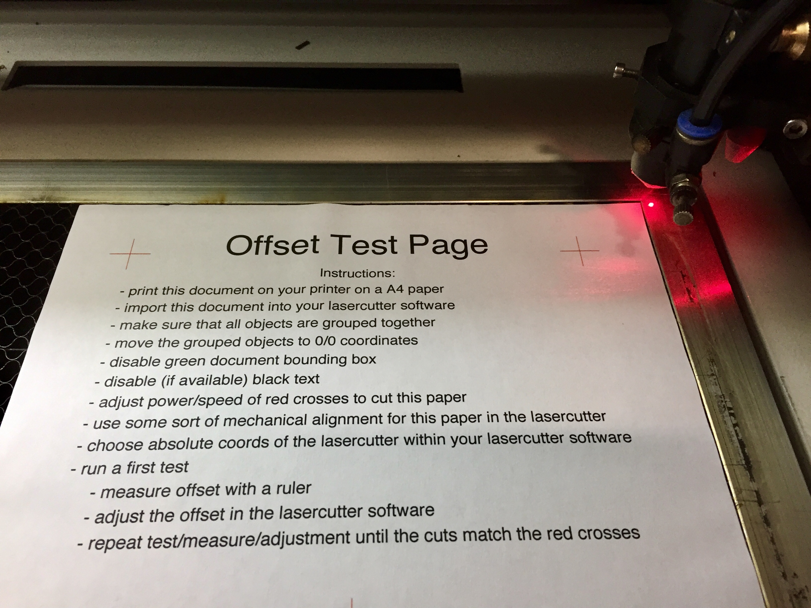
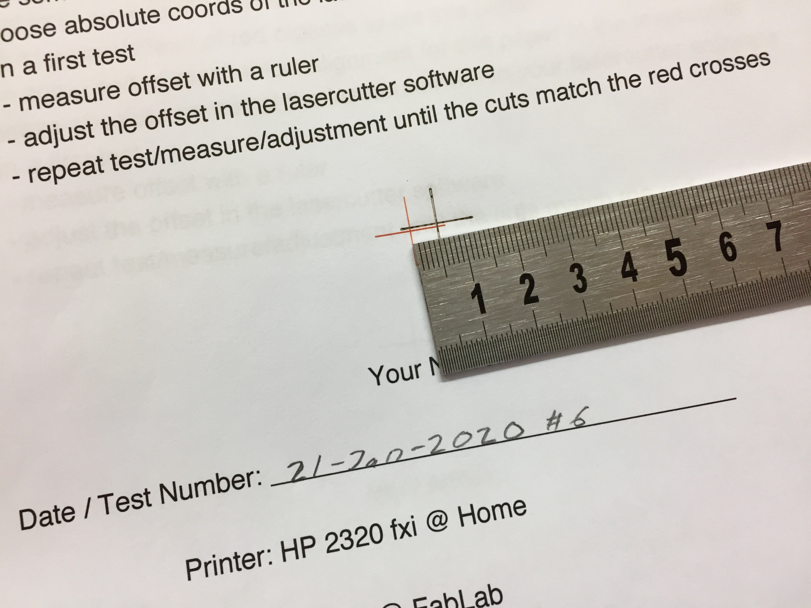
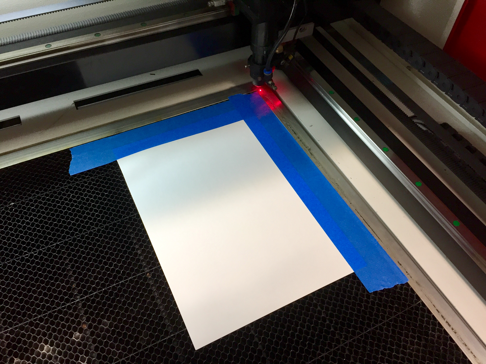
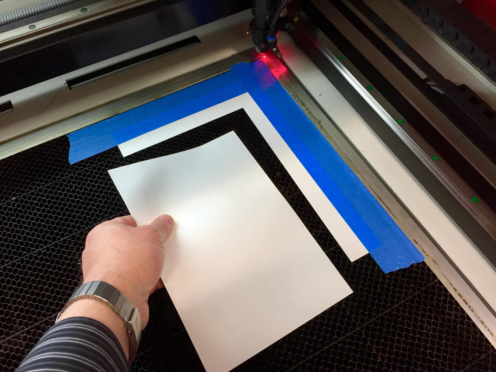
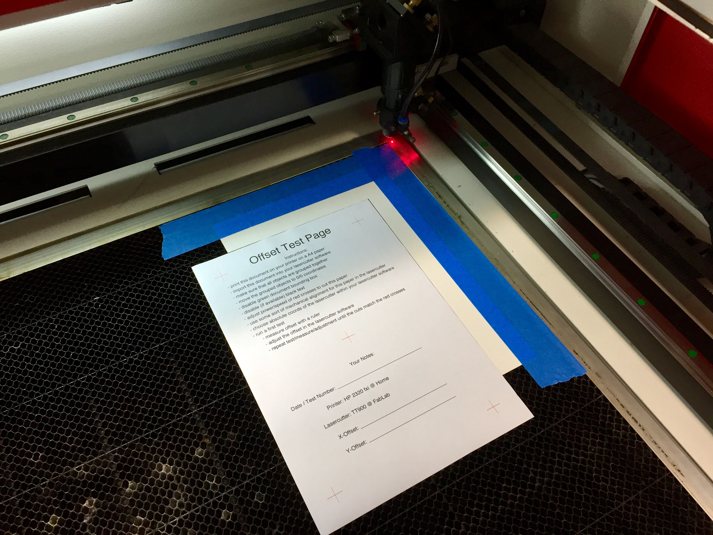

# Align Printer and Cutter Coordinates

## Using the machines mechanical alignment
I try to align it using the lasercutter absolute coordinates and adjusting the offset in the lasercutter software (in this case [LightBurn](https://lightburnsoftware.com/)):

Print the [offsetTestPage](Files/offsetTestPage_A4.pdf) to Paper place the paper in to the lasercutter using some sort of mechanical alignment:

Measure offset with a ruler. Adjust offset in the lasercutter software. Repeat test/measure/adjust until the cuts match the red crosses:

## Create your own mechanical alignment
If the above method doesn't work for you then you may try this method.
Tape down a paper. Move the imported document (in my case i used an offset of 70 mm on X and Y) in your laser cutter software. Disable red and enable the green lines and cut.

Remove the cutted paper.

Use it to align the printed paper:

