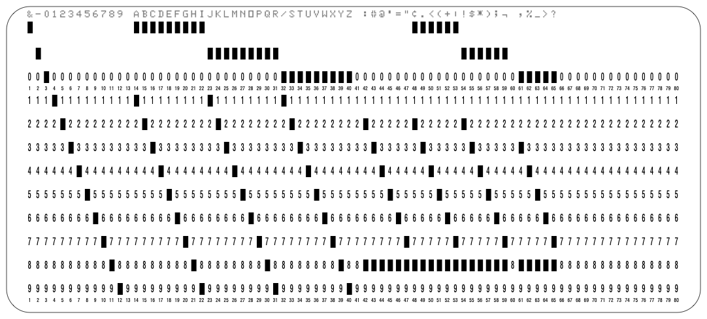
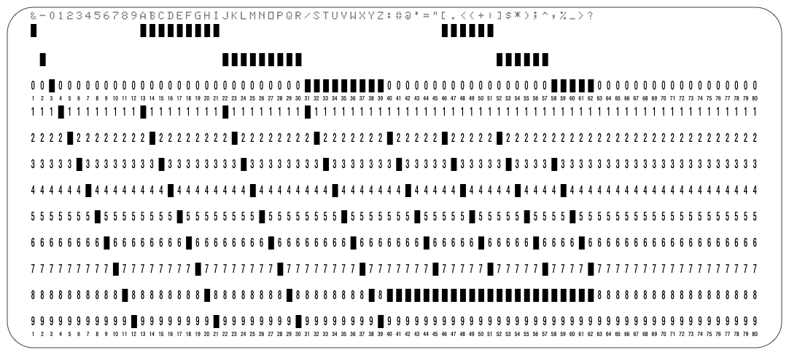

# Card Code
A very good information source about how the different codings is the [Punched Card Codes](http://homepage.divms.uiowa.edu/~jones/cards/codes.html) Page which is Part of [ Douglas W. Jones Punched Card Collection](http://homepage.divms.uiowa.edu/~jones/cards/index.html).
Other good resources are:
* [The Punched Card](http://www.quadibloc.com/comp/cardint.htm)
* [Collected Information on Punched Card Codes](http://www.chilton-computing.org.uk/acl/literature/chapman/p013.htm)
* [100+ Codes](https://ub.fnwi.uva.nl/computermuseum/DWcodes.html) Compiled by the late Dik Winter (CWI, Amsterdam).

## IBM026
The [IBM 026](http://www.columbia.edu/cu/computinghistory/026.html) is a [Key Punching Machine](http://www.columbia.edu/cu/computinghistory/keypunch.html) to create punched cards. The Machine was introduced in July 1949. It is the first Key Punching Machine where the Operator had Keyboard like a Typewriter before there was one key per hole (the coding was done manually by the Operator).

### Code Plates
Code Plates where used to 'store' the 5 × 7 dot matrix character glyphs. The code plate is a tiny, roughly stamp-sized piece of metal containing a grid of tiny projections. The purpose of this code plate is to encode and generate character glyphs in a flexible manner: Where there are projections, a printing dot is encoded, where the projections are milled off, the respective dot will remain blank. On the IBM026 the Code Plate had a 7 x 8 Code Grid which had 47 valid characters for printing. This Code Grid was enlarged for the later Models IBM029 and IBM129. See the [Punched Card Typography — IBM 026, 029, 129](https://www.masswerk.at/misc/card-punch-typography/) for more information.

For the IBM026 the following Code Plates existed (This Information was taken from  [24 Card Punch 26 Printing Card Punch Parts Catalog](http://bitsavers.informatik.uni-stuttgart.de/pdf/ibm/punchedCard/Keypunch/024-026/123-7091-3_24_25_Parts_Catalog_Apr1963.pdf) on Page 21 Print Unit Asm Code Plate). Option A and H where the most common one.

| Part No | Option | 12 | 11 | 0-1 | 8-3 | 12-8-3 | 11-8-3 | 0-8-3 | 8-4 | 12-8-4 | 11-8-4 | 0-8-4 |
|--------:|:------:|:--:|:--:|:---:|:---:|:------:|:------:|:-----:|:---:|:------:|:------:|:-----:|
|  312047 |   A    | &  |  - |  /  |  #  |   .    |    $   |   ,   |  @  |   ¤    |   *    |   %   |
|  313334 |   B    | /  |  - |  &  |  #  |   .    |    $   |   ,   |  @  |   ¤    |   *    |   %   |
|  313335 |   C    | &  |  - |  0  |  #  |   .    |    $   |   ,   |  @  |   ¤    |   *    |   %   |
|  313336 |   D    | -  |  - |  /  |  #  |   .    |    $   |   ,   |  @  |   ¤    |   *    |   %   |
|  340949 |   E    | -  |  / |  &  |  #  |   .    |   ???  |   ,   |  >  |   <    |   *    |   %   |
|  340950 |   G    | +  |  - |  /  |  +  |   .    |    $   |   ,   |  -  |   ¤    |   *    |   %   |
|  341097 |   F    | +  |  - |  /  |  =  |   .    |    $   |   ,   |  -  |   )    |   *    |   (   |
|  362277 |   H    | +  |  - |  /  |  =  |   .    |    $   |   ,   |  '  |   )    |   *    |   (   |
|  362276 |   A    | &  |  - |  /  |  #  |   .    |    $   |   ,   |  @  |   ¤    |   *    |   %   |

### IBM026A (Commercial)
Look for Option A in the table above. Sometimes this configuration was also called 'Alphanumeric' or 'BCD-A'.

### IBM026B
I haven't found any information about this Code Plate (execpt it's existence and information in the Table above).  

### IBM026H (Fortran)
Look for Option H in the table above. Sometimes this configuration was also called 'Hollerith' or 'BCD-H'.

## IBM029
The [IBM 029 Key Punch](http://www.columbia.edu/cu/computinghistory/029.html) was introduced in about 1964.

### Code Plates
On the IBM029 the Code Plate had a 8 x 8 Code Grid which had 63 valid characters for printing.
See [IBM029 Field Engineering Maintenance Manual](http://www.ed-thelen.org/comp-hist/IBM029-Field-Eng-Maint-Man-r.pdf) Page 56-64 Print Unit Figure 4-39 Overlay for Figure 4-40, Figure 4-40 Code Plate Chart E'L', Figure 4-46 Character Patterns E'L', Figure 4-47 Character Patterns E'A' and [Reference Manual IBM 29 Card Punch](http://bitsavers.informatik.uni-stuttgart.de/pdf/ibm/punchedCard/Keypunch/029/A24-3332-3_29_Reference_Man.pdf) Page 38 Printing / Character Arrangements and Page 42 Figure 29 Key Graphics and Punched-Hole Codes
Taken from [IBM029 Card Punch Illustrated Parts Catalog](http://bitsavers.informatik.uni-stuttgart.de/pdf/ibm/punchedCard/Keypunch/029/S124-0085-5_29_Parts_Man_Dec68.pdf) Page 117-120

| Part No | Description                            |
|--------:|----------------------------------------|
| 5372327 | Plate-Printing Code E A                |
| 5372328 | Plate-Printing Code E B                |
| 5372329 | Plate-Printing Code E C                |
| 5372330 | Plate-Printing Code E D                |
| 5372331 | Plate-Printing Code E E                |
| 5372332 | Plate-Printing Code E F                |
| 5372333 | Plate-Printing Code E G                |
| 5372334 | Plate-Printing Code E H                |
| 5372335 | Plate-Printing Code E J                |
| 5372336 | Plate-Printing Code E K                |
| 5372337 | Plate-Printing Code E L                |
| 5404164 | Code Plate used with Spanish N Feature |

## IBM029EBCD

## IBM 129
The [IBM 129 Key Punch](http://www.columbia.edu/cu/computinghistory/129.html) was introduced in about 1971.

### Code Plates
Taken from [Parts Catalog IBM 129 Card Data Recorder Models 1-3](http://bitsavers.informatik.uni-stuttgart.de/pdf/ibm/punchedCard/Keypunch/129/S123-1055-5_129_Parts_Catalog_Dec73.pdf) Page 87-88

| Part No | Description                               |
|--------:|-------------------------------------------|
|  963307 | Code Plate-Katakana                       |
| 5372334 | Code Plate, H Character Set               |
| 5372337 | Code Plate, USA/Italy/Ger/Spain/Latin Am. |
| 5480436 | Code Plate, ASCII                         |
| 8107850 | Code Plate, Finland/Sweden                |
| 8107939 | Code Plate, Denmark/Norway                |
| 8109173 | Code Plate, U.K. English                  |
| 8109283 | Code Plate, French(FRANC)/Belgium         |
| 8110399 | Code Plate, Portugal                      |
| 8112110 | Code Plate, Brazil                        |
