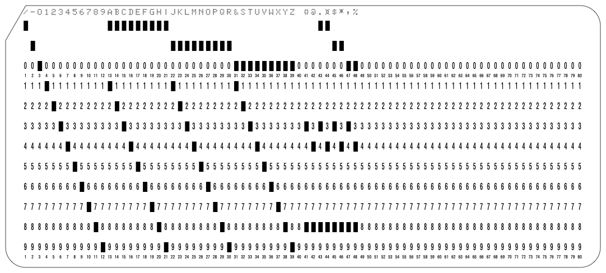
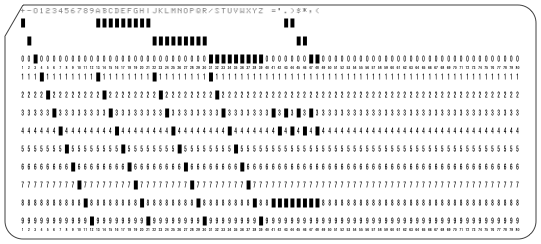
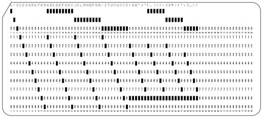

# Card Code

## IBM026

Taken from  [24 Card Punch 26 Printing Card Punch Parts Catalog](http://bitsavers.informatik.uni-stuttgart.de/pdf/ibm/punchedCard/Keypunch/024-026/123-7091-3_24_25_Parts_Catalog_Apr1963.pdf) on Page 21 Print Unit Asm Code Plate

| Part No | Option | 12 | 11 | 0-1 | 8-3 | 12-8-3 | 11-8-3 | 0-8-3 | 8-4 | 12-8-4 | 11-8-4 | 0-8-4 |
|--------:|:------:|:--:|:--:|:---:|:---:|:------:|:------:|:-----:|:---:|:------:|:------:|:-----:|
|  312047 |   A    | &  |  - |  /  |  #  |   .    |    $   |   ,   |  @  |   ¤    |   *    |   %   |
|  313334 |   B    | /  |  - |  &  |  #  |   .    |    $   |   ,   |  @  |   ¤    |   *    |   %   |
|  313335 |   C    | &  |  - |  0  |  #  |   .    |    $   |   ,   |  @  |   ¤    |   *    |   %   |
|  313336 |   D    | -  |  - |  /  |  #  |   .    |    $   |   ,   |  @  |   ¤    |   *    |   %   |
|  340949 |   E    | -  |  / |  &  |  #  |   .    |   ???  |   ,   |  >  |   <    |   *    |   %   |
|  340950 |   G    | +  |  - |  /  |  +  |   .    |    $   |   ,   |  -  |   ¤    |   *    |   %   |
|  341097 |   F    | +  |  - |  /  |  =  |   .    |    $   |   ,   |  -  |   )    |   *    |   (   |
|  362277 |   H    | +  |  - |  /  |  =  |   .    |    $   |   ,   |  '  |   )    |   *    |   (   |
|  362276 |   A    | &  |  - |  /  |  #  |   .    |    $   |   ,   |  @  |   ¤    |   *    |   %   |

### IBM026A (Commercial)

### IBM026B

### IBM026H (Fortran)

## IBM029

## IBM029EBCD

