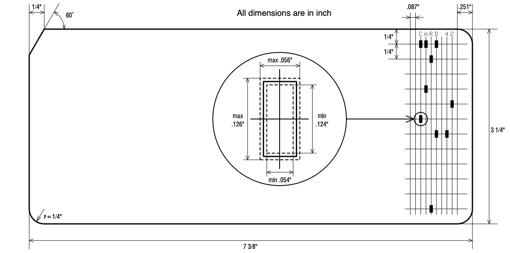
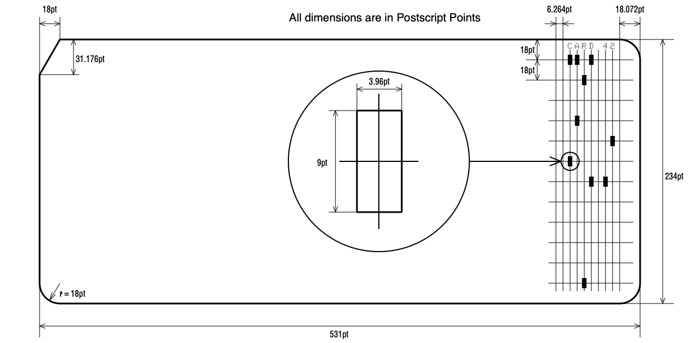

# Card Dimensions

## Specifications in Inch

## Dimensions converted into Postscript Points

## Standards:
* ANSI INCITS 21-1967 (R2002): Rectangular Holes in Twelve-Row Punched
* ISO 1681:1973(en): Information processing - Unpunched paper cards - Specification
* ISO 6586:1980(en): Data processing — Implementation of the ISO 7- bit and 8- bit coded character sets on punched cards
