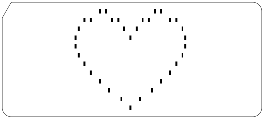

# Example Image Heart

## Input
(see File: [Files/test_input/image_heart](Files/test_input/image_heart))

```
22:1 2
23:0 3
25:4 11
27:5 11
30:6 12
32:12
33:7
34:11
36:11
37:8
38:0
40:9 1
42:0
43:8
44:11
46:11
47:7
48:12
50:6 12
53:5 11
55:4 11
57:0 3
58:1 2
```

## Command

```
./punchcard.sh -I test_input/image_heart -t Blank -D -o PunchedCard_Example_Image_Heart_DocOutput
```

## Documentation Output
(see File: [Fotos/PunchedCard_Example_Image_Heart_DocOutput.eps](Fotos/PunchedCard_Example_Image_Heart_DocOutput.eps) or converted to a [PDF](Fotos/PunchedCard_Example_Image_Heart_DocOutput.pdf))

