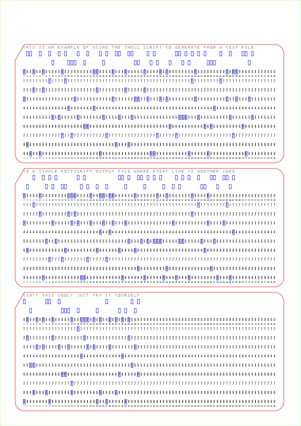

# Example Text Single Output File

## Input
(see File: [Files/test_input/example_text_multi_output_file.txt](Files/test_input/example_text_multi_output_file.txt)

```
THIS IS AN EXAMPLE OF USING THE SHELL SCRIPT TO GENERATE FROM A TEXT FILE
TO A SINGLE POSTSCRIPT OUTPUT FILE WHERE EVERY LINE IS ANOTHER CARD
ISN'T THIS COOL? JUST TRY IT YOURSELF
```

## Command

```
./punchcard.sh -i test_input/example_text_single_output_file.txt -o PunchedCard_Example_Text_Single_Output
```

## Output
(see File: [Fotos/PunchedCard_Example_Text_Single_Output.eps](Fotos/PunchedCard_Example_Text_Single_Output.eps) or converted to a [PDF](Fotos/PunchedCard_Example_Text_Single_Output.pdf))

