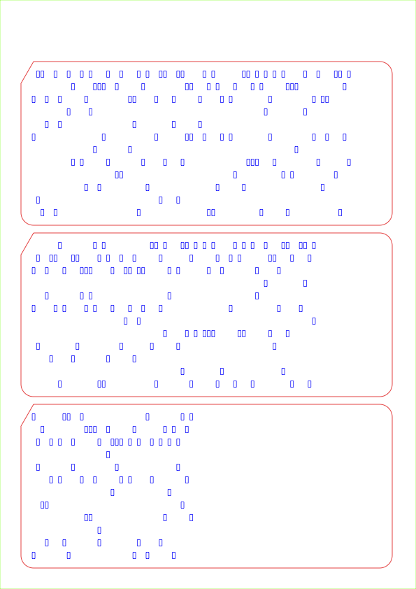

# Example Text Split Output Files

## Input
(see File: [Files/test_input/example_text_split_output_file.txt](Files/test_input/example_text_split_output_file.txt)

```
THIS IS AN EXAMPLE OF USING THE SHELL SCRIPT TO GENERATE FROM A TEXT FILE
TO SPLIT POSTSCRIPT OUTPUT FILES WHERE EVERY LINE IS ANOTHER CARD
ISN'T THIS COOL? JUST TRY IT YOURSELF
```

## Command

```
./punchcard.sh -i test_input/example_text_split_output_files.txt -s -o PunchedCard_Example_Text_Split_Output
```

## Printer Output
(see File: [Fotos/PunchedCard_Example_Text_Split_Output_printer.eps](Fotos/PunchedCard_Example_Text_Split_Output_printer.eps) or converted to a [PDF](Fotos/PunchedCard_Example_Text_Split_Output_printer.pdf))


## Cutter Output
(see File: [Fotos/PunchedCard_Example_Text_Split_Output_cutter_0001.eps](Fotos/PunchedCard_Example_Text_Split_Output_cutter_0001.eps) or converted to a [PDF](Fotos/PunchedCard_Example_Text_Split_Output_cutter_0001.pdf))

