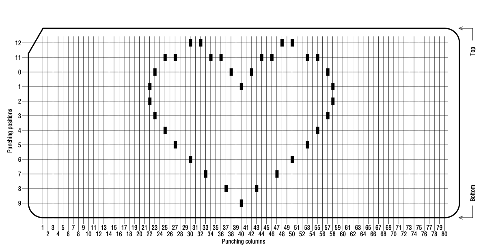

# Image Input Format

The image input file has to be a simple text file containing lines like these:
```
<punching column>:<punching position> [<punching position> ... <punching position>]
```

Example:
```
1:1 12
```

## Full Example

Image:


Code:
```
22:1 2
23:0 3
25:4 11
27:5 11
30:6 12
32:12
33:7
34:11
36:11
37:8
38:0
40:9 1
42:0
43:8
44:11
46:11
47:7
48:12
50:6 12
53:5 11
55:4 11
57:0 3
58:1 2
```
