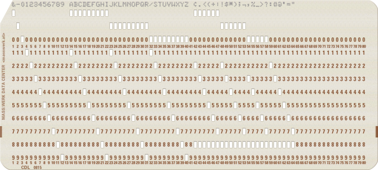

# PunchedCard
Creating IBM 80-column [Punched Cards](https://en.wikipedia.org/wiki/Punched_card) using Laser Printer and [Laser Cutter](https://en.wikipedia.org/wiki/Laser_cutting).

The idea came when somebody at the 'Vintage Computer Festival Zurich' showed me the [Virtual Keypunch](https://www.masswerk.at/keypunch/) (by [mass:werk](https://www.masswerk.at/)) to visualize young Java-Programmers how much data for a SOAP-Request/-Response is sent.

Here is a sample Punched Card:


mass:werk is offering some other Punched Card Services:
* [Virtual Card Read-Punch](https://www.masswerk.at/card-readpunch/)
* [Punch Card Sampler](https://www.masswerk.at/cardsampler/)
* Font Editor for [IBM 026](https://www.masswerk.at/misc/card-punch-typography/editor026.html) or [IBM 029 and 129](https://www.masswerk.at/misc/card-punch-typography/editor.html)

And a nice documetation about [Punched Card Typography — IBM 026, 029, 129](https://www.masswerk.at/misc/card-punch-typography/).

## Other Punch Card Services:
* [Cardpunch: punch a punched card](http://www.kloth.net/services/cardpunch.php)
* [punch-card encoding ported to Processing](https://github.com/jeffThompson/PunchCardEncoding)
* [Virtual IBM Punch Card Data Processing](http://sims.durgadas.com/punchcards/ibm029.html)

## Script
In order to create your own punched cards you need to have access to:
* (Laser-)Printer
* Laser Cutter

If you are a Linux or MacOSX user you may use this script without additional software. Depending on your laser cutter software or printer you may require a postscript converter such as Ghostscript on Linux, Preview on MacOSX or any other Vector Graphics Editor. Windows user may use an virtual machine running Linux or use something like [Cygwin](www.cygwin.com).

### Script Usage
The Shell-Script in this repository generates postcript file(s) form a text input file.
```
host:user$ ./punchcard.sh -h
usage: ./punchcard.sh [options]

options are:
 -i <file>      # input file name
 -c <code>      # card coding (default: IBM029)
 -C <corners>   # card corners (default: Left)
 -S             # change from round to square corners
 -t <type>      # card type (default: IBM5081)
 -o <outfile>   # output base file name (default: punchcard)
 -s             # split output
 -h             # this help text

host:user$ 
```
See the currently implemented [card types](CardTypes.md) and [card corners](CardCorners.md).

## More information about Punched Cards:
* [The Punched Card](http://www.quadibloc.com/comp/cardint.htm)
* [Punched Card Codes](http://homepage.divms.uiowa.edu/~jones/cards/codes.html) (Part of [ Douglas W. Jones Punched Card Collection](http://homepage.divms.uiowa.edu/~jones/cards/index.html))
* [Jim Scott's 'A Collection Of Punched Cards](http://www.jkmscott.net/data/Punched%20Cards.html)
* [Collected Information on Punched Card Codes](http://www.chilton-computing.org.uk/acl/literature/chapman/p013.htm)
* [columbia.edu: The IBM 026 Key Punch](http://www.columbia.edu/cu/computinghistory/026.html)
* [columbia.edu: The IBM 029 Key Punch](http://www.columbia.edu/cu/computinghistory/029.html)
* [Keypunch029 — for all your punched card font needs ...](https://scruss.com/blog/2017/03/21/keypunch029-for-all-your-punched-card-font-needs/)
* [Two-Bit History: The IBM 029 Card Punch](https://twobithistory.org/2018/06/23/ibm-029-card-punch.html)
* PDF: [IBM029 Field Engineering Maintenance Manual](http://www.ed-thelen.org/comp-hist/IBM029-Field-Eng-Maint-Man-r.pdf)
* PDF: [Reference Manual IBM 24 Card Punch and IBM 26 Printing Card Punch](http://bitsavers.informatik.uni-stuttgart.de/pdf/ibm/punchedCard/Keypunch/024-026/A24-0520-3_24_26_Card_Punch_Reference_Manual_Oct1965.pdf)
* PDF: [IBM Customer Engineering Manual of Instruction Card Punch Type 24 and Printing Card Punch Type 26](http://bitsavers.informatik.uni-stuttgart.de/pdf/ibm/punchedCard/Keypunch/024-026/22-8319-0_24_26_Customer_Engineering_Preliminary_Manual_of_Instruction_1950.pdf)
* PDF: [Do Not Fold, Spindle or Mutilate — THE ‘HOLE’ STORY OF PUNCHED CARDS](http://www.gfierheller.ca/wp-content/uploads/2014/02/Do-Not-Fold-Feb-7-2014-web.pdf)
* PDF: [The Design of IBM Cards](http://bitsavers.org/pdf/ibm/punchedCard/Training/22-5526-4_The_Design_of_IBM_Cards_Mar56.pdf)
* PDF: [Van Ness - Principles of Punched Card Data Processing](https://ia601602.us.archive.org/5/items/bitsavers_ibmpunchedPrinciplesofPunchedCardDataProcessing196_18048029/Van_Ness_Principles_of_Punched_Card_Data_Processing_1962.pdf)
* [IBM Punch Cards](http://www.columbia.edu/cu/computinghistory/cards.html)
* [Early Card Punch Machines](http://www.columbia.edu/cu/computinghistory/oldpunch.html)
* [Code like a girl: The First Program I Ever Wrote](https://code.likeagirl.io/the-first-program-i-ever-wrote-5a5a6b08469c)
* English Wikipedia-Article: [Computer programming in the punched card era](https://en.wikipedia.org/wiki/Computer_programming_in_the_punched_card_era)
* English Wikipedia-Article: [Fortran](https://en.wikipedia.org/wiki/Fortran)
* English Wikipedia-Article: [COBOL](https://en.wikipedia.org/wiki/COBOL)
* [Punched card facts for kids](https://kids.kiddle.co/Punched_card)
* [IBM Punch Cards](http://www.columbia.edu/cu/computinghistory/cards.html)
* PDF: [A  Programmer's Introduction to IBM System/360 Assembler Language](http://bitsavers.trailing-edge.com/pdf/ibm/360/asm/SC20-1646-6_int360asm_Aug70.pdf)
* PDF: [Systems Reference Library: IBM System/360 Basic Programming Support Basic Assembler Language](http://www.bitsavers.org/pdf/ibm/360/bos_bps/C20-6503-0_BAL_Feb65.pdf)
* PDF: [SLAC Computation Group CGTM 17 Aug-1967: SYSTEM/360 ASSEMBLER LANGUAGE PROGRAMMING](https://www.slac.stanford.edu/vault/collvault/greylit/cgtm/CGTM17A.pdf)
* WikiBook: [360 Assemby](https://en.wikibooks.org/wiki/360_Assembly)
* German Wikipedia-Article: [Lochkarte](https://de.wikipedia.org/wiki/Lochkarte)
* YouTube-Video: [1964 IBM 029 Keypunch Card Punching Demonstration](https://www.youtube.com/watch?v=YnnGbcM-H8c)
* YouTube-Video: [Punch Card Programming - Computerphile](https://www.youtube.com/watch?v=KG2M4ttzBnY)
* YouTube-Video: [Computer Punch Cards Historical Overview - IBM Remington Rand UNIVAC - History Archives, # CH-0093](https://www.youtube.com/watch?v=kKJxzay85Vk)
* YouTube-Video: [PeriscopeFilm - PUNCHED CARD DATA PROCESSING INTRODUCTION IBM 029 COMPUTER 62454](https://www.youtube.com/watch?v=etu-cH-nkIA)

## Standards:
* ANSI INCITS 21-1967 (R2002): Rectangular Holes in Twelve-Row Punched 
* ISO 1681:1973(en): Information processing - Unpunched paper cards - Specification
* ISO 6586:1980(en): Data processing — Implementation of the ISO 7- bit and 8- bit coded character sets on punched cards

## Hints, Tips and Tricks
* [Align Printer and Cutter Coordinates](AlignPrinterAndCutterCoordinates.md)
